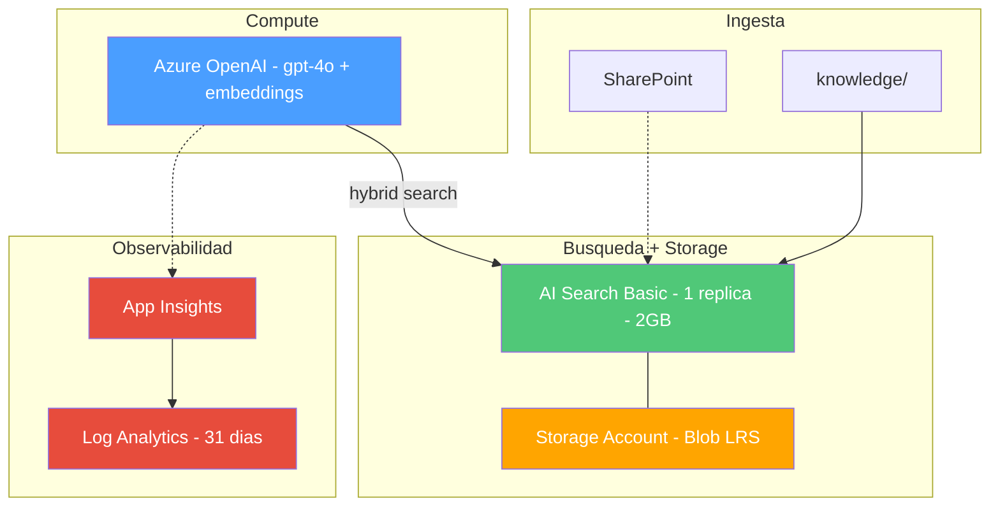
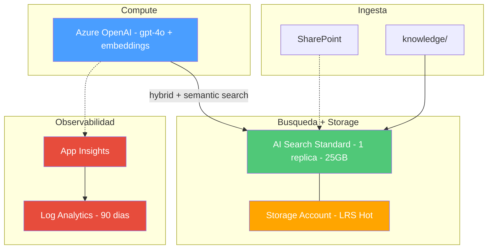
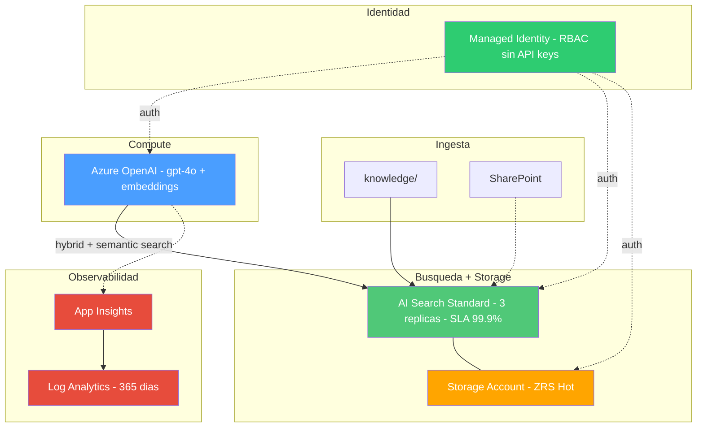
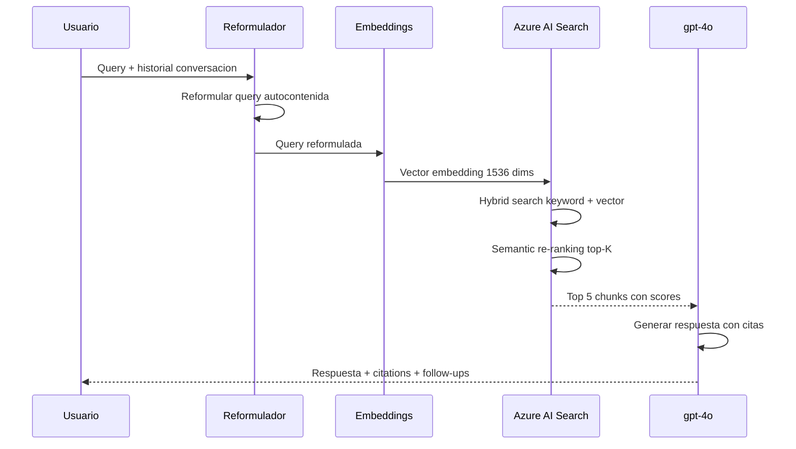
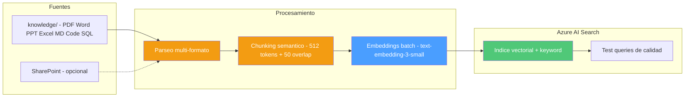
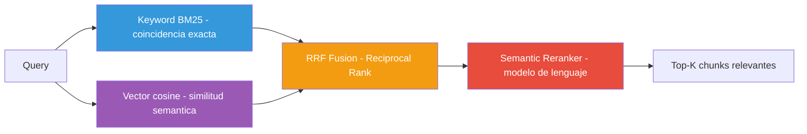
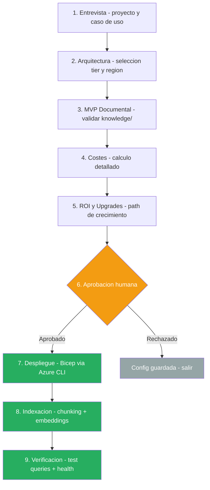
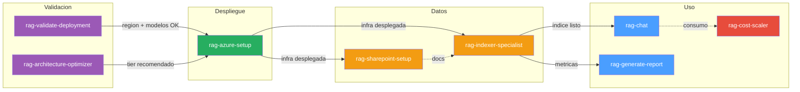
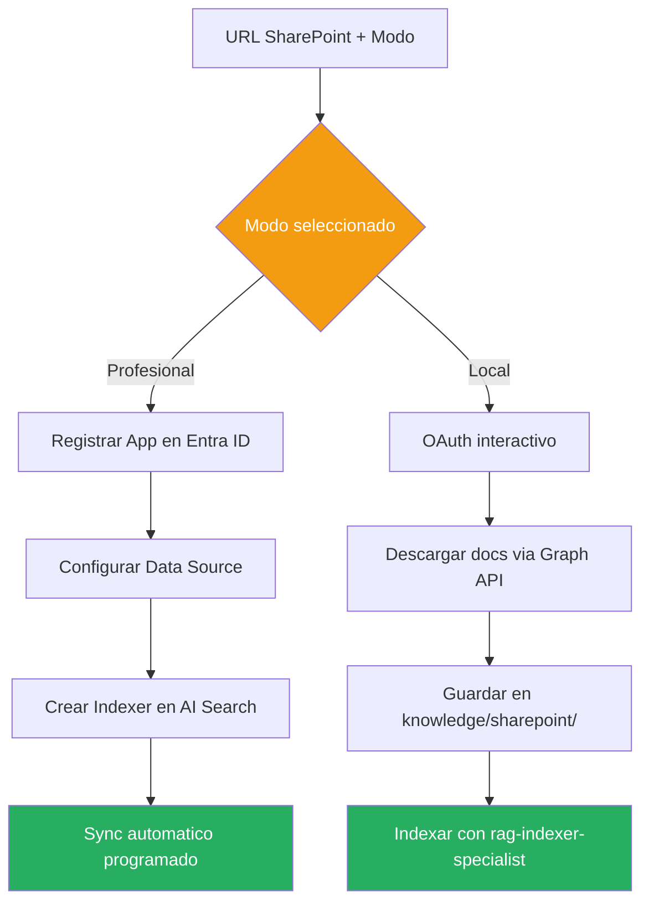

# RAG Builder

**Tu base de conocimiento empresarial en ~45 minutos.** Conecta documentos → Azure AI Search → pregunta en lenguaje natural.

> Framework completo: 8 agentes + 15 skills + Spec-Driven Development. Onboarding guiado, despliegue automatizado, costes controlados.

---

## ¿Qué es esto?

Un framework llave en mano para montar un sistema RAG (Retrieval-Augmented Generation) sobre Azure. Metes tus documentos, ejecutas el onboarding, y tienes un chat inteligente sobre tu conocimiento corporativo.

| Sin RAG Builder | Con RAG Builder |
|---|---|
| Semanas configurando Azure OpenAI + Search + embeddings | ~45 minutos con onboarding guiado |
| Documentación dispersa en carpetas, SharePoint, emails | Un índice unificado con búsqueda semántica |
| Respuestas genéricas de ChatGPT sin contexto de empresa | Respuestas precisas con citas a TUS documentos |
| Costes impredecibles en Azure | Tiers predefinidos con alertas automáticas |
| Sin trazabilidad de uso | Telemetría completa con Application Insights |

**Formatos soportados:** PDF, Word, PowerPoint, Excel, Markdown, código fuente, SQL (scripts, procedimientos, vistas), texto plano.

---

## Inicio rápido

```bash
# 1. Instalar dependencias
pip install -r .github/requirements.txt

# 2. Lanzar onboarding (explica arquitectura, costes y ROI ANTES de desplegar)
copilot-cli run .github/agents/rag-onboarding.agent.md
```

El onboarding te guía paso a paso: valida región, calcula costes, pide aprobación, despliega infra e indexa tus documentos.

---

## Arquitecturas RAG

Tres configuraciones con la **misma estructura**, diferente capacidad. Los diagramas muestran solo lo que cambia entre tiers.

> **Siempre disponible en todos los tiers:** Copilot Chat, API REST, CLI, informes DOCX, SharePoint connector, búsqueda híbrida y Budget Alerts.

### 🟢 Mínima — Dev / Testing / PoC

Para validar el concepto, demos internas o equipos de 1-5 personas.



| Componente | Config |
|---|---|
| AI Search | Basic (2GB, 15 indexes, 1 replica) |
| Storage | Blob LRS |
| Log Analytics | 31 dias retencion |
| Identidad | API keys |
| **Coste estimado** | **~$82/mes** |

---

### 🟡 Estándar — Producción / Equipos medianos

Para uso diario en equipos de 5-50 personas con observabilidad completa.



| Componente | Config |
|---|---|
| AI Search | Standard (25GB, 50 indexes, 1 replica) |
| Storage | LRS Hot |
| Log Analytics | 90 dias retencion |
| Identidad | API keys |
| **Coste estimado** | **~$335/mes** |

---

### 🔴 Máxima — Enterprise / Alta disponibilidad

Para organizaciones con alta concurrencia, volumen masivo y requisitos de compliance.



| Componente | Config |
|---|---|
| AI Search | Standard (25GB, 50 indexes, **3 replicas** - SLA 99.9%) |
| Storage | **ZRS** Hot (redundancia de zona) |
| Log Analytics | **365 dias** retencion |
| Identidad | **Managed Identity + RBAC** (sin API keys) |
| **Coste estimado** | **~$975/mes** |

---

## Cómo funciona el RAG

### Pipeline de consulta (Chat Q&A)



### Pipeline de indexacion



### Busqueda hibrida - 3 tecnicas combinadas



Resultado: encontrar la información correcta aunque el usuario pregunte con palabras distintas a las del documento.

---

## Flujo de Onboarding (9 fases)



---

## Agentes

| Agente | Qué hace |
|---|---|
| `rag-onboarding` | **Punto de entrada** — guía completa desde 0 hasta RAG funcionando |
| `rag-validate-deployment` | Valida presupuesto, región y disponibilidad de modelos |
| `rag-azure-setup` | Despliega infraestructura Azure (Bicep) |
| `rag-indexer-specialist` | Indexa documentos en Azure AI Search |
| `rag-sharepoint-setup` | Conecta SharePoint (real-time o descarga local) |
| `rag-chat` | Chat conversacional multi-turno |
| `rag-generate-report` | Genera informes ejecutivos (DOCX) |
| `rag-cost-scaler` | Escala tiers + configura alertas de presupuesto |

### Orquestacion de Agentes

El onboarding orquesta a los demás agentes en orden. Cada uno tiene una responsabilidad clara:



**Leyenda:** Violeta = validacion | Verde = infra | Naranja = datos | Azul = runtime | Rojo = coste

---

## Skills

15 módulos reutilizables (Python/PowerShell):

| Skill | Propósito |
|---|---|
| `rag-query-cli` | Búsqueda interactiva por CLI |
| `rag-indexer` | Indexar documentos de `knowledge/` |
| `rag-diagnostics` | Estado del sistema y monitoreo |
| `rag-api-server` | API REST para integrar con apps |
| `rag-cost-analyst` | Validar costes + disponibilidad por región |
| `rag-cost-scaler` | Escalar configuración entre tiers |
| `rag-deployment-templates` | Bicep para infraestructura Azure |
| `rag-agent-instrumentation` | Métricas y Application Insights |
| `rag-sharepoint-connector` | Integración SharePoint |
| `rag-report-generator` | Informes ejecutivos (Claude Opus 4.7) |
| `rag-architecture-optimizer` | Validar tamaño de servicios |
| `rag-orchestration` | Orquestador de fases del onboarding |
| `rag-qa-engine` | Motor Q&A conversacional |
| `rag-storage-connector` | Conexión Azure Blob Storage |
| `rag-validator` | Validar cumplimiento Microsoft guidelines |

### Flujo de Despliegue Azure

```mermaid
graph LR
    subgraph CONFIG[Configuracion]
        PARAMS[Tier + Region + Nombre]
    end

    subgraph INFRA[Azure CLI + Bicep]
        RG[Crear Resource Group]
        OAI[Desplegar OpenAI - gpt-4o + embeddings]
        SRCH[Desplegar AI Search - SKU segun tier]
        BLOB[Desplegar Storage - LRS o ZRS]
        INSIGHTS[Desplegar App Insights + Log Analytics]
    end

    subgraph VERIFY[Verificacion]
        CONN[Test conectividad]
        ENV[Generar .env]
    end

    PARAMS --> RG
    RG --> OAI
    OAI --> SRCH
    SRCH --> BLOB
    BLOB --> INSIGHTS
    INSIGHTS --> CONN
    CONN -->|OK| ENV

    style RG fill:#3498db,color:#fff
    style OAI fill:#4a9eff,color:#fff
    style SRCH fill:#50c878,color:#fff
    style BLOB fill:#ffa500,color:#fff
    style INSIGHTS fill:#e74c3c,color:#fff
```



### Flujo SharePoint - Dual Mode



---

## Estructura del repositorio

Este repo es **el template que se copia**. Todo está dentro de `.github/`:

```text
.github/                   ← Copia ESTO a tu proyecto
├── README.md              ← Este fichero
├── requirements.txt
├── agents/                ← 8 agentes (.agent.md) — definiciones
├── instructions/          ← Reglas de comportamiento por agente
├── prompts/               ← Slash commands SDD (/specify, /plan, /tasks, /implement)
├── skills/                ← 15 módulos (SKILL.md + código Python)
├── specify/               ← Motor SDD (Spec-Driven Development)
│   ├── memory/
│   │   └── constitution.md    ← Principios no-negociables
│   ├── templates/             ← Templates para spec, plan, tasks
│   └── scripts/               ← Validadores (completitud + constitution)
└── specs/                 ← EJEMPLOS del RAG Builder (referencia)
    └── {feature}/
        ├── spec.md
        ├── plan.md
        └── tasks.md

specs/                     ← TU proyecto RAG (creas aquí después de copiar .github/)
└── {tu-feature}/
    ├── spec.md            ← Qué: I/O contract, success criteria
    ├── plan.md            ← Cómo: arquitectura, dependencias, riesgos
    └── tasks.md           ← Implementación: tareas atómicas ordenadas
```

**Cómo se usa:**

```bash
# 1. Copiar template a tu proyecto
cp -r .github/ mi-rag/.github/

# 2. Crear tus propios specs en la raíz
mkdir -p mi-rag/specs
```

Dentro de `.github/specs/` encontrarás **ejemplos reales** del RAG Builder para entender cómo estructurar tus propios specs.

---

## Estructura del proyecto desplegado

Después de ejecutar el onboarding, se crea `rag-{nombre}/` como hermano de `.github/`:

```text
rag-{nombre}/              ← Tu proyecto RAG (ej: rag-mensadef/)
├── knowledge/             ← Tus documentos (cualquier estructura)
├── outputs/               ← Resultados: informes DOCX, resúmenes, logs
│   └── setup-summary.json ← Config elegida durante onboarding
└── .env                   ← Credenciales Azure (generado automáticamente)
```

> `knowledge/` acepta cualquier organización interna — carpetas por tema, por equipo, plano... Azure AI Search indexa todo el contenido recursivamente sin importar la estructura de carpetas.

---

## Modelos utilizados

| Modelo | Uso | Por qué |
|---|---|---|
| **gpt-4o** (Azure OpenAI) | Generación de respuestas | Mejor relación calidad/coste para RAG |
| **text-embedding-3-small** (Azure OpenAI) | Vectorización de documentos | 1536 dims, barato, suficiente para RAG |
| **Claude Opus 4.7** (agentes) | Reportes ejecutivos, chat, validación | Razonamiento profundo para tareas complejas |
| **Claude Haiku 4.5** (agentes) | Scaffolding, orquestación, indexación | Rápido y eficiente para tareas estructuradas |

> Los modelos Azure OpenAI se despliegan en tu suscripción. Claude se usa desde los agentes de Copilot.

---

## Desarrollo: Spec-Driven Development (SDD)

Este proyecto usa [GitHub Spec Kit](https://github.com/github/spec-kit) como proceso de desarrollo. Ninguna feature se implementa sin spec aprobada.

**Flujo completo (4 pasos):**

```text
/specify   → specs/{feature}/spec.md    (define QUÉ)
/plan      → specs/{feature}/plan.md    (define CÓMO)
/tasks     → specs/{feature}/tasks.md   (define pasos de implementación)
/implement → código real                (ejecuta los pasos)
```

### Dos modos de implementación

| Modo | Comando | Cuándo usar |
|------|---------|-------------|
| **Agentes (por defecto)** | Invocar directamente al agente (`@rag-indexer`, `@rag-azure-setup`, etc.) | Flujo rápido — el agente conoce su dominio y ejecuta sin trámite |
| **SDD formal** | `/implement` después de `/specify` → `/plan` → `/tasks` | Cuando necesitas trazabilidad completa: auditoría, revisión por equipo, o features complejas multi-agente |

> **Por defecto usamos agentes.** Los 8 agentes del proyecto ya saben implementar sus features directamente. El flujo `/implement` existe para cuando quieres el rigor completo de spec-kit (por ejemplo, una feature nueva que cruza múltiples skills).

**Constitution:** `.github/specify/memory/constitution.md` — 11 principios no-negociables (cost awareness, zero credential leaks, observability, error handling, RAG architecture, etc.)

**Validación antes de mergear:**

```powershell
.\.specify\scripts\Validate-Spec.ps1 -SpecPath "specs/mi-feature/spec.md"
.\.specify\scripts\Validate-Constitution.ps1 -Path "specs/mi-feature/spec.md"
```

---

## Costes estimados

> Precios en USD basados en [Azure Pricing](https://azure.microsoft.com/pricing/) (mayo 2026). El coste dominante es **Azure AI Search** (~85-90% del total).

| Tier | Coste/mes | Qué cambia en Azure |
|---|---|---|
| 🟢 Mínima | **~$82** | Search Basic (2GB, 15 indexes), Storage LRS, logs 31d, sin SLA HA. |
| 🟡 Estándar | **~$335** | Search Standard (25GB, 50 indexes), Storage LRS, logs 90d. |
| 🔴 Máxima | **~$975** | Search Standard × 3 réplicas (SLA 99.9%), Storage ZRS, Managed Identity, logs 365d. |

**Desglose por componente:**

| Componente | Mínima | Estándar | Máxima |
|---|---|---|---|
| Azure AI Search | Basic $75 (1 SU) | Standard $295 (1 SU) | Standard $885 (3 SUs) |
| Azure OpenAI (pay-per-use) | ~$5 | ~$25 | ~$50 |
| Storage Account | ~$2 (LRS) | ~$5 (LRS) | ~$10 (ZRS) |
| App Insights | $0 (free tier) | $0 (free tier) | $0 (free tier) |
| Log Analytics (retención) | $0 (31d incluidos) | ~$10 (90d) | ~$30 (365d) |
| **Total estimado** | **~$82** | **~$335** | **~$975** |

> **Nota:** El coste de OpenAI es variable (pay-per-use). Las estimaciones asumen: Mínima ~1K queries/mes, Estándar ~5K, Máxima ~10K. Pricing: gpt-4o $2.50/1M input + $10/1M output; text-embedding-3-small $0.02/1M tokens.

Escalar entre tiers sin downtime:

```powershell
.github/skills/rag-cost-scaler/cost-scaler.ps1 -Action ChangeTo -Tier standard
```

**Referencias:**

- [RAG in Azure AI Search — Microsoft Learn](https://learn.microsoft.com/en-us/azure/search/retrieval-augmented-generation-overview)
- [Spec Kit — Documentación](https://github.github.com/spec-kit/)
- [Spec Kit — Repositorio](https://github.com/github/spec-kit)
