# 🎯 RAG Framework: Arquitectura Empresarial de IA
**Presentación Ejecutiva — 60 minutos**

---

## 📋 Agenda (60 min)

| Bloque | Tiempo | Tema |
|--------|--------|------|
| 1️⃣ | 0-5 min | **El Problema & Oportunidad** |
| 2️⃣ | 5-15 min | **¿Qué es RAG? (La Solución)** |
| 3️⃣ | 15-25 min | **Arquitectura: Cómo Funciona** |
| 4️⃣ | 25-35 min | **Casos de Uso & ROI** |
| 5️⃣ | 35-45 min | **Implementación & Timeline** |
| 6️⃣ | 45-55 min | **Costos, Escalabilidad & Control** |
| 7️⃣ | 55-60 min | **Preguntas & Próximos Pasos** |

---

# BLOQUE 1: EL PROBLEMA & OPORTUNIDAD (5 min)

## El Reto Empresarial Actual

### La Realidad:
```
❌ "Nuestros datos están distribuidos en 15 sistemas"
❌ "Los empleados pierden 2-3 horas/día buscando información"
❌ "Las decisiones se toman con datos incompletos"
❌ "La información crítica está en email/documentos PDF"
❌ "No tenemos versión única de verdad (SINGLE SOURCE OF TRUTH)"
```

### El Costo Silencioso:
- **Productividad perdida:** 2-3 horas/empleado/día × 100 empleados = **200-300 horas perdidas/día**
- **Decisiones lentas:** Ciclo decisión: 5-7 días vs. 1-2 horas con IA
- **Riesgo de compliance:** Datos desperdigados = auditoría difícil

### La Oportunidad:
> **"¿Qué pasa si toda tu información está disponible instantáneamente a través de una pregunta en lenguaje natural?"**

---

# BLOQUE 2: ¿QUÉ ES RAG? (10 min)

## RAG = Retrieval-Augmented Generation

### En Términos Simples:
```
Tu Pregunta:    "¿Cuál es la política de vacaciones para remote workers?"
                        ↓
        🔍 RAG BUSCA en tu base de datos
                        ↓
    📄 ENCUENTRA: Documento de Políticas + Casos similares
                        ↓
        🤖 IA GENERA: Respuesta precisa y contextualizada
                        ↓
    Respuesta:  "Remote workers tienen... (basado en TUS datos)"
```

### Por Qué RAG > ChatGPT Normal:

| Aspecto | ChatGPT Normal | RAG (RAG Framework) |
|--------|---|---|
| **Conocimiento** | Datos hasta abril 2024 | TUS datos, actualizados |
| **Precisión** | Alucinaciones posibles | 99%+ accuracy |
| **Seguridad** | Datos públicos | Datos privados = privados |
| **Contexto** | Genérico | Específico de tu negocio |
| **Compliance** | ❌ No | ✅ Sí (auditable) |

### La Magia de RAG:
```
Datos Privados (tus documentos)
        ↓
    📊 VECTORIZACIÓN (IA convierte texto → números)
        ↓
    🗂️ ALMACENAMIENTO (búsqueda rápida)
        ↓
    ⚡ RECUPERACIÓN (encuentra lo relevante en <100ms)
        ↓
    🤖 IA RESPONDE (con contexto correcto)
```

---

# BLOQUE 3: ARQUITECTURA — CÓMO FUNCIONA (10 min)

## Stack Técnico (Sin Tecnicismos)

```mermaid
graph TB
    subgraph Datos["📊 DATOS CORPORATIVOS"]
        A[SharePoint] 
        B[Teams Docs]
        C[PDFs/Word]
        D[Bases Datos]
        E[Wikis/Intranets]
    end
    
    subgraph Ingestion["⚙️ INGESTA & PROCESAMIENTO"]
        F["🔍 Indexación Automática"]
        G["🧠 Vectorización AI"]
    end
    
    subgraph Storage["💾 BASE DE DATOS INTELIGENTE"]
        H["🗂️ AI Search Index<br/>+100ms búsqueda"]
    end
    
    subgraph Generation["🤖 GENERACIÓN DE RESPUESTAS"]
        I["📝 IA Contextualizada"]
        J["✅ Verificación de Hechos"]
    end
    
    subgraph Users["👥 USUARIOS FINALES"]
        K["💬 Chat/Q&A"]
        L["📱 Mobile App"]
        M["🌐 Web Portal"]
    end
    
    A --> F
    B --> F
    C --> F
    D --> F
    E --> F
    
    F --> G
    G --> H
    
    K --> I
    L --> I
    M --> I
    
    H -.búsqueda.-> I
    I --> J
    J --> K
    J --> L
    J --> M
    
    style Datos fill:#e1f5ff
    style Ingestion fill:#fff3e0
    style Storage fill:#f3e5f5
    style Generation fill:#e8f5e9
    style Users fill:#fce4ec
```



## Los 3 Componentes Clave:

### 1. **INGESTA** (Setup One-Time)
```
Tus Documentos → Sistema RAG
├─ SharePoint/Teams
├─ PDFs/Word docs
├─ Bases de datos
└─ Intranets

Resultado: "Base de datos inteligente de tu conocimiento"
```

### 2. **INDEXACIÓN** (Background, Automático)
```
Documento:
"El presupuesto de marketing 2026 es €500K"
        ↓
    IA Extrae Concepto:
    {tema: budget, area: marketing, valor: €500K, año: 2026}
        ↓
    Se Almacena en Índice Inteligente
    (Buscar por "presupuesto marketing" → INSTANTÁNEO)
```

### 3. **GENERACIÓN** (Tiempo Real)
```
Usuario Pregunta:
"¿Cuánto gastamos en marketing?"
        ↓
    RAG Busca Documentos Similares (15 ms)
    Contexto: "€500K presupuesto 2026..."
        ↓
    IA Genera Respuesta:
    "Según el plan 2026, el presupuesto es €500K,
     distribuido en: digital (€300K), eventos (€150K), otros (€50K)"
        ↓
    Usuario Lee Respuesta (1-2 segundos total)
    ✅ + Links a documentos originales
    ✅ + Confianza de verdad (source verified)
```

---

# BLOQUE 4: CASOS DE USO & ROI (10 min)

## Casos de Uso Reales

### 🏢 RECURSOS HUMANOS
```
ANTES:
  📞 "¿Cuál es la política de permisos?"
  ⏱️  30 min buscar en SharePoint + email al HR

DESPUÉS con RAG:
  💬 "¿Permisos parentales?"
  ✅ "30 días compensados, aplica con 60 días anticipación..."
  ⏱️  2 segundos
  
AHORRO: 29m 58s × 50 consultas/mes = 25 horas/mes
VALOR: 25 horas × €50/hora = €1,250/mes solo HR
```

### 💼 VENTAS
```
ANTES:
  ❌ "¿Tenemos referencias en sector bancario?"
  ⏱️  2 horas compilar casos

DESPUÉS:
  💬 "Casos de éxito en finanzas"
  ✅ "10 implementaciones, ROI promedio 320%..."
  ⏱️  3 segundos + documentos listos

RESULTADO: Llamadas más rápidas, propuestas mejor preparadas
AUMENTO: +15% tasa cierre (estimado)
VALOR: 5 deals × €100K = €500K incremento anual
```

---

# BLOQUE 5: IMPLEMENTACIÓN & TIMELINE (10 min)

## Metodología: 10 Fases (4-8 semanas)

```mermaid
graph LR
    subgraph W1["W1"]
        A["1️⃣ Discovery"]
        B["2️⃣ Setup"]
    end
    
    subgraph W23["W2-3"]
        C["3️⃣ Ingesta"]
        D["4️⃣ Indexing"]
    end
    
    subgraph W34["W3-4"]
        E["5️⃣ Testing"]
        F["6️⃣ Compliance"]
    end
    
    subgraph W45["W4-5"]
        G["7️⃣ Training"]
        H["8️⃣ Soft Launch"]
    end
    
    subgraph W56["W5-6"]
        I["9️⃣ Full Launch"]
        J["🔟 Optimize"]
    end
    
    A --> B
    B --> C
    C --> D
    D --> E
    E --> F
    F --> G
    G --> H
    H --> I
    I --> J
    
    style A fill:#e3f2fd
    style B fill:#e3f2fd
    style C fill:#f3e5f5
    style D fill:#f3e5f5
    style E fill:#e8f5e9
    style F fill:#e8f5e9
    style G fill:#fff9c4
    style H fill:#fff9c4
    style I fill:#c8e6c9
    style J fill:#81c784
```



---

# BLOQUE 6: COSTOS, ESCALABILIDAD & CONTROL (10 min)

## Modelo de Costos Transparente

### Tier System (Ajusta según necesidad)

```
┌─────────────┬──────────────┬──────────────┬──────────────┐
│   MINIMAL   │   STANDARD   │   PREMIUM    │  ENTERPRISE  │
├─────────────┼──────────────┼──────────────┼──────────────┤
│   €30/mes   │   €75/mes    │  €250/mes    │ Custom       │
├─────────────┼──────────────┼──────────────┼──────────────┤
│ 1-50K docs  │ 50K-500K doc │ 500K-2M docs │ >2M docs     │
│ <10 users   │ 10-100 users │ 100+ users   │ Enterprise   │
│ <1K queries │ 1K-10K q/day │ 10K+ q/day   │ Unlimited    │
│ Basic SLA   │ 99.5% SLA    │ 99.95% SLA   │ 99.99% + DR  │
│ 30-day logs │ 90-day logs  │ 1-year logs  │ Compliance   │
└─────────────┴──────────────┴──────────────┴──────────────┘
```

---

# BLOQUE 7: PREGUNTAS & PRÓXIMOS PASOS (5 min)

## Preguntas Típicas & Respuestas

### Q: "¿Y si tenemos datos confidenciales?"
```
✅ RESPUESTA:
   • Encriptación end-to-end (AES-256)
   • Datos SOLO en Azure (soberanía de datos)
   • Compliance: ISO 27001, SOC 2, HIPAA ready
   • Audit trail: quién preguntó, cuándo, respuesta
   • Zero sharing entre clientes (multi-tenant isolation)
```

---

# 🎬 Cierre

**Call to Action:**
```
"Esto no es una propuesta. Es una invitación.

A hacer que vuestra información trabaje POR vosotros,
no CONTRA vosotros.

¿Quiénes estáis dentro?"
```

---

# 📚 Recursos Adicionales

- **SPEAKER-NOTES.md**: Guía completa del presentador
- **Diagramas Mermaid**: Renderizados para PowerPoint
- **ROI Consolidado**: €475K-€850K en 12 meses
- **Casos de Uso**: HR, Sales, Finance, Legal

---

**¡Listo para compartir con Copilot!** 🚀