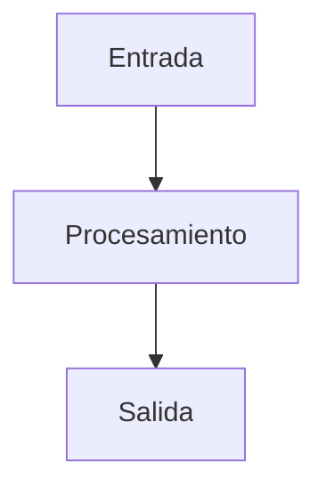

# Plantilla de Plan — RAG Builder

> Usa esta plantilla después de que un spec sea aprobado para definir el enfoque técnico de implementación.

---

# PLAN: {{FEATURE_NAME}}

**Spec:** `specs/{{feature-name}}/spec.md`  
**Estado:** Borrador | Aprobado | En Progreso | Completado  
**Autor:** {{AUTHOR}}  
**Creado:** {{DATE}}

---

## 1. Enfoque Técnico

### Decisión de Arquitectura

Describe el enfoque elegido y por qué.



### Alternativas Consideradas

| Opción | Pros | Contras | Decisión |
|--------|------|---------|----------|
| Opción A | ... | ... | ✅ Seleccionada |
| Opción B | ... | ... | ❌ Rechazada — motivo |

---

## 2. Dependencias

### Internas
- Skills/agentes de los que depende
- Utilidades compartidas necesarias

### Externas
- Servicios Azure requeridos
- Paquetes Python (con restricciones de versión)
- APIs a integrar

### Bloqueantes
- [ ] Cualquier cosa que deba resolverse antes de empezar

---

## 3. Estructura de Ficheros

```
.github/skills/{{feature-name}}/
├── SKILL.md              # Definición del skill
├── {{main_script}}.py    # Implementación principal
├── tests/
│   └── test_{{feature}}.py
└── README.md             # Docs de uso (si es complejo)
```

---

## 4. Flujo de Datos

```
Entrada → Validación → Procesamiento → Salida → Logging
```

Describe cada etapa brevemente:
1. **Validación:** Qué comprobaciones se ejecutan sobre la entrada
2. **Procesamiento:** Pasos de lógica principal
3. **Salida:** Cómo se formatean los resultados
4. **Logging:** Qué telemetría se captura

---

## 5. Riesgos y Mitigaciones

| Riesgo | Probabilidad | Impacto | Mitigación |
|--------|-------------|---------|-----------|
| Descripción del riesgo | Alta/Media/Baja | Alto/Medio/Bajo | Cómo prevenir o manejar |

---

## 6. Observabilidad

- **Métricas:** Qué medir (latencia, tokens, coste)
- **Logs:** Líneas de log clave y sus niveles
- **Alertas:** Condiciones que deben disparar alertas

---

## 7. Esfuerzo Estimado

| Fase | Estimación | Notas |
|------|-----------|-------|
| Implementación | ... | ... |
| Testing | ... | ... |
| Documentation | ... | ... |

---

## 8. Changelog

| Version | Date | Changes |
|---|---|---|
| 0.1.0 | {{DATE}} | Initial plan |
