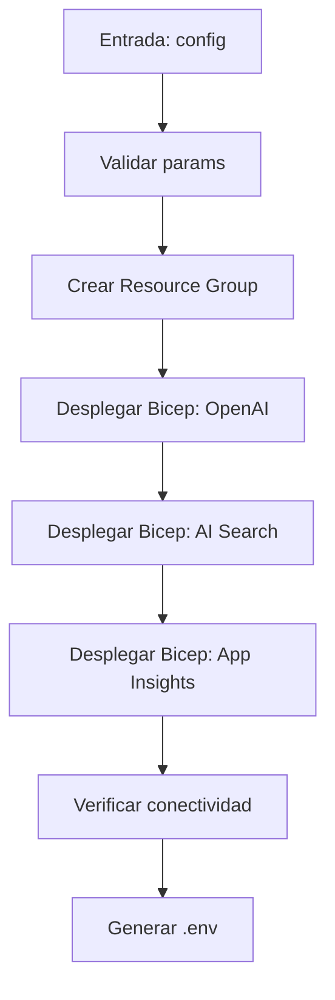

# PLAN: Azure Setup

**Spec:** `specs/azure-setup/spec.md`  
**Estado:** Completado  
**Autor:** RAG Builder Team  
**Creado:** 2026-05-15

---

## 1. Enfoque Técnico

### Decisión de Arquitectura

Despliegue basado en plantillas Bicep con script orquestador (`deploy.sh`). Usa Azure CLI para autenticación y `az deployment group create` para aplicar templates. Genera `.env` con credenciales al final.



### Alternativas Consideradas

| Opción | Pros | Contras | Decisión |
|--------|------|---------|----------|
| Bicep con deploy.sh | Reproducible, versionable, rollback fácil | Requiere Azure CLI | ✅ Seleccionada |
| Terraform | Multi-cloud, state management | Over-engineering para un solo proveedor | ❌ Rechazada |
| Portal Azure manual | Visualmente claro | No reproducible, 30+ min, error-prone | ❌ Rechazada |
| ARM templates directo | Compatible 100% | Verboso, difícil de mantener | ❌ Rechazada |

---

## 2. Dependencias

### Internas
- `rag-deployment-templates` — plantillas Bicep reutilizables
- `rag-architecture-optimizer` — selección de SKU por tier
- `rag-agent-instrumentation` — telemetría del proceso

### Externas
- Azure CLI 2.60+
- Azure subscription con permisos Contributor
- Cuota de Azure OpenAI en la región elegida
- Python 3.11+ (para scripts de validación post-despliegue)

### Bloqueantes
- [x] Subscription activa con cuota OpenAI
- [x] Permisos Contributor en subscription

---

## 3. Estructura de Ficheros

```
.github/agents/
└── rag-azure-setup.agent.md          # Definición del agente

.github/skills/rag-deployment-templates/
├── SKILL.md                           # Definición del skill
├── deploy.sh                          # Orquestador de despliegue
├── bicep/
│   ├── main.bicep                     # Template principal
│   ├── modules/openai.bicep           # Módulo OpenAI
│   ├── modules/search.bicep           # Módulo AI Search
│   └── modules/insights.bicep         # Módulo App Insights
└── README.md
```

---

## 4. Flujo de Datos

```
Config → Validación → Resource Group → Bicep Deploy → Verificación → .env
```

1. **Validación:** Comprobar región, modelos, subscription, cuota
2. **Resource Group:** Crear si no existe
3. **Bicep Deploy:** Ejecutar main.bicep con parámetros del tier elegido
4. **Verificación:** Ping a cada recurso creado (endpoint health)
5. **Generación .env:** Keys, endpoints, connection strings

---

## 5. Riesgos y Mitigaciones

| Riesgo | Probabilidad | Impacto | Mitigación |
|--------|-------------|---------|-----------|
| Cuota agotada en región | Media | Alto | Pre-check con validate-deployment |
| Modelo no disponible en región | Baja | Alto | Lista de regiones con disponibilidad |
| Timeout en despliegue Bicep | Baja | Medio | Timeout de 20 min con retry |
| Credenciales expuestas en logs | Baja | Crítico | Nunca loguear keys, solo .env local |

---

## 6. Observabilidad

- **Métricas:** Duración total del despliegue, recursos creados, tier elegido
- **Logs:** Inicio/fin de cada paso Bicep, errores de API, estado de verificación
- **Alertas:** Fallo en despliegue → notificación inmediata

---

## 7. Esfuerzo Estimado

| Fase | Estimación | Notas |
|------|-----------|-------|
| Implementación | Completado | deploy.sh + bicep modules |
| Testing | Completado | Despliegue validado en eastus/westeurope |
| Documentación | Completado | SKILL.md + README |
