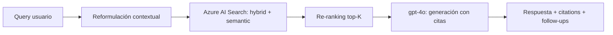

# PLAN: Chat (RAG Q&A)

**Spec:** `specs/chat/spec.md`  
**Estado:** Completado  
**Autor:** RAG Builder Team  
**Creado:** 2026-05-15

---

## 1. Enfoque Técnico

### Decisión de Arquitectura

Pipeline de 3 etapas: Reformulación → Búsqueda Híbrida → Generación con citas. Usa Azure AI Search para retrieval y gpt-4o para generación. Mantiene historial conversacional en memoria (sesión).



### Alternativas Consideradas

| Opción | Pros | Contras | Decisión |
|--------|------|---------|----------|
| Hybrid search + semantic ranking | Mejor recall+precision | Ligeramente más caro | ✅ Seleccionada |
| Solo keyword search | Más barato | Pierde conceptos semánticos | ❌ Rechazada |
| Solo vector search | Bueno para conceptos | Pierde matches exactos (IDs, nombres) | ❌ Rechazada |
| LangChain orchestration | Framework popular | Dependencia pesada, abstracción innecesaria | ❌ Rechazada |

---

## 2. Dependencias

### Internas
- `rag-qa-engine` — motor de consultas (implementación principal)
- `rag-agent-instrumentation` — telemetría por consulta
- Índice creado por `rag-indexer-specialist`

### Externas
- Azure AI Search (con semantic configuration habilitada)
- Azure OpenAI (gpt-4o para generación, text-embedding-3-small para queries)
- Python: `azure-search-documents`, `openai`, `azure-identity`

### Bloqueantes
- [x] Índice poblado con documentos
- [x] Infraestructura Azure desplegada

---

## 3. Estructura de Ficheros

```
.github/agents/
└── rag-chat.agent.md                # Definición del agente

.github/skills/rag-qa-engine/
├── SKILL.md                          # Definición del skill
├── qa_engine.py                      # Motor Q&A principal
├── search_client.py                  # Wrapper de Azure Search
├── prompt_templates.py               # Prompts del sistema
└── README.md
```

---

## 4. Flujo de Datos

```
Query → Reformulación → Embedding → Search → Rerank → Prompt → LLM → Response
```

1. **Reformulación:** Si hay historial, reformula query para ser auto-contenida
2. **Embedding:** Genera vector de la query reformulada
3. **Search:** Hybrid query (keyword + vector) con semantic ranking
4. **Rerank:** Top-K chunks por relevancia semántica
5. **Prompt:** System prompt + chunks + historial + query
6. **LLM:** gpt-4o genera respuesta con instrucción de citar fuentes
7. **Response:** Parsea citas, sugiere follow-ups

---

## 5. Riesgos y Mitigaciones

| Riesgo | Probabilidad | Impacto | Mitigación |
|--------|-------------|---------|-----------|
| Alucinaciones sin fundamento | Baja | Alto | Instrucción explícita "solo cita documentos" + validación |
| Latencia > 5s | Media | Medio | Limitar top_k, usar streaming si es posible |
| Coste por query alto | Baja | Medio | Token budget, chunks concisos |
| Historial desborda contexto | Media | Medio | Ventana deslizante de últimos 5 turnos |

---

## 6. Observabilidad

- **Métricas:** Latencia P50/P95, tokens/query, coste/query, chunks_retrieved
- **Logs:** Query original, query reformulada, nº resultados, modelo usado
- **Alertas:** Latencia > 8s, coste/query > $0.10, tasa de "No encontré" > 30%

---

## 7. Esfuerzo Estimado

| Fase | Estimación | Notas |
|------|-----------|-------|
| Implementación | Completado | qa_engine.py + search_client.py |
| Testing | Completado | Test set con preguntas de validación |
| Documentación | Completado | SKILL.md + agent.md |
