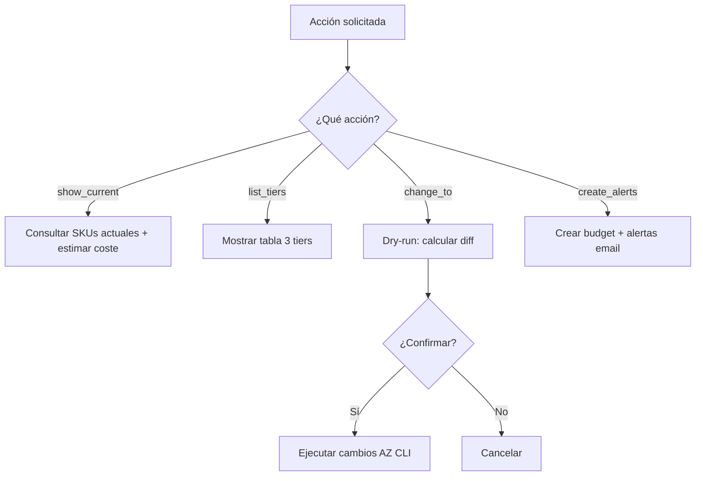

# PLAN: Cost Scaler

**Spec:** `specs/cost-scaler/spec.md`  
**Estado:** Completado  
**Autor:** RAG Builder Team  
**Creado:** 2026-05-15

---

## 1. Enfoque Técnico

### Decisión de Arquitectura

Script PowerShell con 4 acciones: `show_current`, `list_tiers`, `change_to`, `create_alerts`. Usa Azure CLI para consultar y modificar recursos. Siempre ejecuta dry-run primero (calculando diff de coste) y requiere confirmación explícita.



### Alternativas Consideradas

| Opción | Pros | Contras | Decisión |
|--------|------|---------|----------|
| PowerShell + AZ CLI | Nativo Windows, sin deps extra | Solo Windows/PS | ✅ Seleccionada |
| Python + Azure SDK | Cross-platform | Más dependencias, más código | ❌ Rechazada |
| Bicep re-deploy | Infraestructura como código | Overkill para cambiar un SKU | ❌ Rechazada |
| Azure Policy auto-scale | Automático | Demasiado opaco, sin control usuario | ❌ Rechazada |

---

## 2. Dependencias

### Internas
- `rag-cost-analyst` — estimaciones de coste para la tabla comparativa
- `rag-agent-instrumentation` — logging de acciones

### Externas
- Azure CLI 2.60+ (autenticado)
- PowerShell 7+
- Permisos: Contributor en resource group

### Bloqueantes
- [x] Infraestructura RAG ya desplegada
- [x] Resource group conocido

---

## 3. Estructura de Ficheros

```
.github/agents/
└── rag-cost-scaler.agent.md           # Definición del agente

.github/skills/rag-cost-scaler/
├── SKILL.md                            # Definición del skill
├── cost-scaler.ps1                     # Script principal
└── README.md
```

---

## 4. Flujo de Datos

```
Acción → Consultar estado actual → Calcular cambios → Confirmar → Aplicar → Verificar
```

1. **Consultar:** `az resource list` + `az search service show` para estado actual
2. **Calcular:** Diff entre tier actual y tier destino (USD/mes)
3. **Confirmar:** Mostrar tabla de cambios con costes, pedir Yes/No
4. **Aplicar:** `az search service update`, `az monitor action-group create`
5. **Verificar:** Confirmar nuevo SKU activo, recalcular coste

---

## 5. Riesgos y Mitigaciones

| Riesgo | Probabilidad | Impacto | Mitigación |
|--------|-------------|---------|-----------|
| Downscale pierde índice | Baja | Crítico | Verificar que nuevo tier soporta el tamaño actual |
| Timeout en cambio de SKU | Baja | Medio | Polling cada 30s hasta completado |
| Alertas no se envían | Baja | Bajo | Verificar action group con test |

---

## 6. Observabilidad

- **Métricas:** Escalados ejecutados, ahorro mensual acumulado, alertas disparadas
- **Logs:** Acción, tier origen → destino, coste antes/después
- **Alertas:** Budget > 80%, cambio de tier fallido

---

## 7. Esfuerzo Estimado

| Fase | Estimación | Notas |
|------|-----------|-------|
| Implementación | Completado | cost-scaler.ps1 |
| Testing | Completado | Dry-run validado |
| Documentación | Completado | SKILL.md + README |
