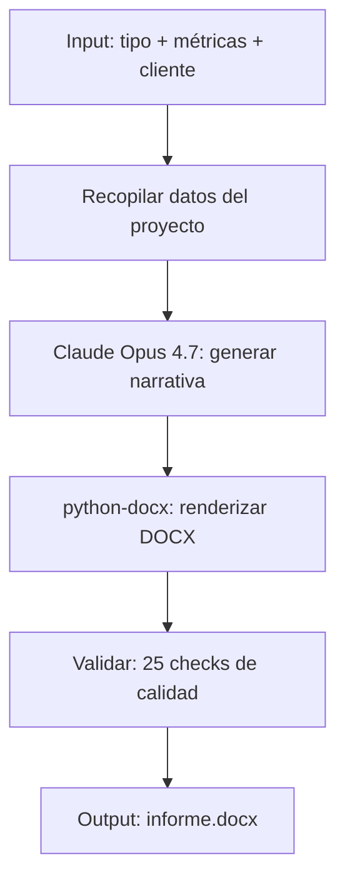

# PLAN: Generate Report

**Spec:** `specs/generate-report/spec.md`  
**Estado:** Completado  
**Autor:** RAG Builder Team  
**Creado:** 2026-05-15

---

## 1. Enfoque Técnico

### Decisión de Arquitectura

Generación en 3 fases: recopilación de métricas → narrativa IA (Claude Opus 4.7) → renderizado DOCX con python-docx. Incluye portada profesional, tabla de contenidos, secciones con métricas cuantificadas, y recomendaciones estratégicas.



### Alternativas Consideradas

| Opción | Pros | Contras | Decisión |
|--------|------|---------|----------|
| Claude Opus + python-docx | Narrativa de alta calidad + formato pro | Requiere API Anthropic | ✅ Seleccionada |
| Template estático con variables | Rápido, predecible | Sin narrativa, genérico | ❌ Rechazada |
| GPT-4o para narrativa | Más barato | Narrativa menos ejecutiva, menos matizada | ❌ Rechazada |
| LaTeX → PDF | Formato profesional | Curva de aprendizaje, dependencia TeX | ❌ Rechazada |

---

## 2. Dependencias

### Internas
- `rag-agent-instrumentation` — telemetría del proceso
- Métricas de `rag-indexer-specialist` y `rag-cost-analyst`

### Externas
- Anthropic API (Claude Opus 4.7)
- Python: `python-docx`, `anthropic`
- Datos del proyecto (métricas de indexación, costes, precisión)

### Bloqueantes
- [x] API key de Anthropic disponible
- [x] Métricas del proyecto recopiladas

---

## 3. Estructura de Ficheros

```
.github/skills/rag-report-generator/
├── SKILL.md                       # Definición del skill
├── report_generator.py            # Generador principal
├── templates/                     # Estilos y portadas
│   └── styles.py                  # Configuración de estilos DOCX
├── prompts/                       # System prompts para narrativa
│   └── executive_prompt.md
└── README.md
```

---

## 4. Flujo de Datos

```
Métricas → Prompt → Claude → Narrativa → python-docx → DOCX → Validación
```

1. **Recopilación:** Gather métricas (docs indexados, precisión, ahorro, ROI)
2. **Prompt:** Construir prompt ejecutivo con métricas como datos
3. **Claude:** Genera narrativa en tono ejecutivo (no técnico)
4. **Renderizado:** python-docx con portada, secciones, tablas, saltos de página
5. **Validación:** 25 checks (portada existe, métricas presentes, formato OK)

---

## 5. Riesgos y Mitigaciones

| Riesgo | Probabilidad | Impacto | Mitigación |
|--------|-------------|---------|-----------|
| Claude genera narrativa genérica | Media | Medio | Prompt muy específico con métricas concretas |
| Formato DOCX roto | Baja | Medio | Validar con python-docx antes de guardar |
| Métricas incompletas | Media | Bajo | Defaults razonables para campos opcionales |

---

## 6. Observabilidad

- **Métricas:** Informes generados, tiempo de generación, tokens Claude consumidos
- **Logs:** Tipo de informe, cliente, métricas usadas, validaciones pasadas
- **Alertas:** Generación > 5 min, validación falla

---

## 7. Esfuerzo Estimado

| Fase | Estimación | Notas |
|------|-----------|-------|
| Implementación | Completado | report_generator.py + styles |
| Testing | Completado | Generación end-to-end validada |
| Documentación | Completado | SKILL.md + README |
