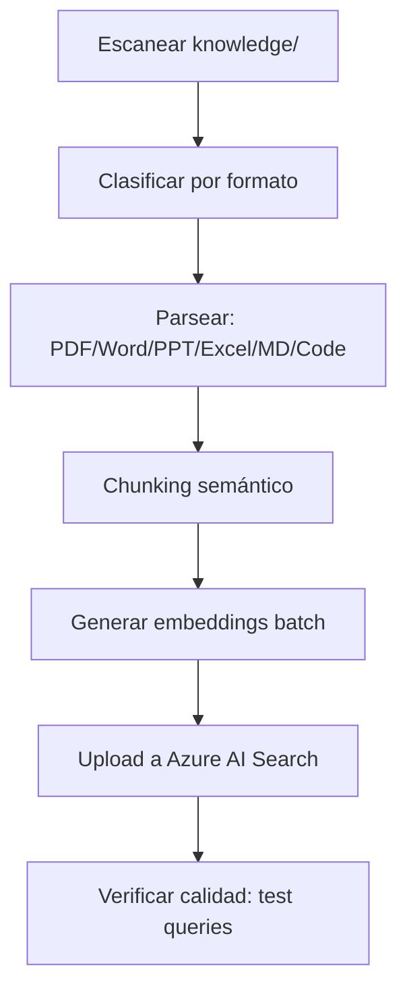

# PLAN: Indexer Specialist

**Spec:** `specs/indexer/spec.md`  
**Estado:** Completado  
**Autor:** RAG Builder Team  
**Creado:** 2026-05-15

---

## 1. Enfoque Técnico

### Decisión de Arquitectura

Pipeline de procesamiento por lotes: escaneo de carpeta → parseo multi-formato → chunking con overlap → generación de embeddings en batch → upload a Azure AI Search con schema predefinido.



### Alternativas Consideradas

| Opción | Pros | Contras | Decisión |
|--------|------|---------|----------|
| Pipeline propio multi-formato | Control total, optimizado para nuestros formatos | Más código a mantener | ✅ Seleccionada |
| Azure AI Search built-in indexer | Zero code | No soporta todos nuestros formatos, chunking limitado | ❌ Rechazada |
| LlamaIndex | Framework popular | Dependencia pesada, abstracción opaca | ❌ Rechazada |
| Unstructured.io | Buen parseo | Dependencia externa, pricing opaco | ❌ Rechazada |

---

## 2. Dependencias

### Internas
- `rag-azure-setup` — infraestructura (Search + OpenAI deben existir)
- `rag-agent-instrumentation` — telemetría del proceso de indexación

### Externas
- Azure AI Search (índice + schema)
- Azure OpenAI (text-embedding-3-small para embeddings)
- Python: `azure-search-documents`, `openai`, `pypdf2`, `python-docx`, `python-pptx`, `openpyxl`, `tiktoken`

### Bloqueantes
- [x] Infraestructura Azure desplegada
- [x] Carpeta knowledge/ con documentos

---

## 3. Estructura de Ficheros

```
.github/agents/
└── rag-indexer-specialist.agent.md   # Definición del agente

.github/skills/rag-indexer/
├── SKILL.md                           # Definición del skill
├── indexer.py                         # Orquestador de indexación
├── parsers/                           # Parsers por formato
│   ├── pdf_parser.py
│   ├── docx_parser.py
│   ├── pptx_parser.py
│   ├── excel_parser.py
│   ├── markdown_parser.py
│   └── code_parser.py
├── chunker.py                         # Chunking con overlap
├── embedder.py                        # Generación de embeddings batch
└── README.md
```

---

## 4. Flujo de Datos

```
Documentos → Parseo → Chunks → Embeddings → Upload → Verificación
```

1. **Escaneo:** Recorre knowledge/ recursivamente, filtra por extensión
2. **Parseo:** Extrae texto plano + metadatos (páginas, secciones, autor)
3. **Chunking:** 400 tokens/chunk con 50 tokens overlap, respeta fronteras
4. **Embeddings:** Batch de 16 chunks por request a OpenAI
5. **Upload:** Lotes de 100 documentos a Azure Search
6. **Verificación:** 3 test queries para validar retrieval

---

## 5. Riesgos y Mitigaciones

| Riesgo | Probabilidad | Impacto | Mitigación |
|--------|-------------|---------|-----------|
| Formato no soportado | Media | Bajo | Skipear con warning, loguear fichero |
| Rate limiting de OpenAI | Media | Medio | Backoff exponencial + batching |
| Documentos corruptos | Baja | Bajo | Try/catch por archivo, continuar |
| Chunks demasiado grandes | Baja | Medio | Validar con tiktoken antes de upload |

---

## 6. Observabilidad

- **Métricas:** Docs procesados, chunks generados, tokens consumidos, tiempo total
- **Logs:** Inicio/fin por archivo, errores de parseo, rate limits
- **Alertas:** Tasa de error > 10%, indexación > 30 min

---

## 7. Esfuerzo Estimado

| Fase | Estimación | Notas |
|------|-----------|-------|
| Implementación | Completado | indexer.py + parsers + chunker |
| Testing | Completado | Validado con PDF, Word, MD, código |
| Documentación | Completado | SKILL.md + README |
