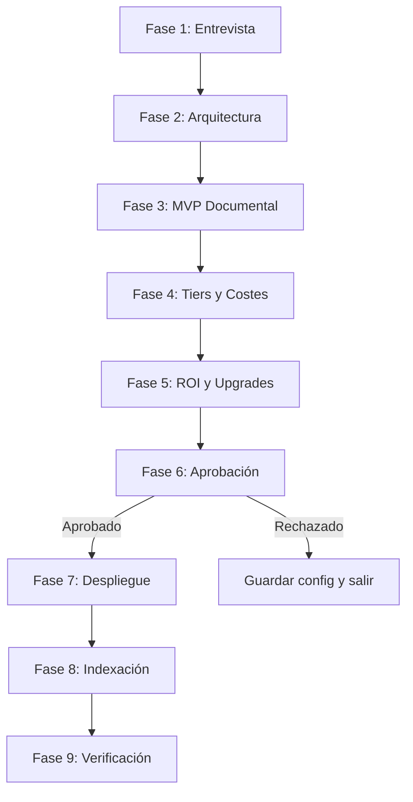

# PLAN: Onboarding Wizard

**Spec:** `specs/onboarding/spec.md`  
**Estado:** Completado  
**Autor:** RAG Builder Team  
**Creado:** 2026-05-15

---

## 1. Enfoque Técnico

### Decisión de Arquitectura

Orquestador secuencial de 9 fases con confirmación humana obligatoria antes del despliegue. Cada fase es un paso atómico con rollback implícito (si falla, el usuario puede reintentar desde esa fase).



### Alternativas Consideradas

| Opción | Pros | Contras | Decisión |
|--------|------|---------|----------|
| Orquestador secuencial con gates | Claro, predecible, controlable | Más lento que "todo de golpe" | ✅ Seleccionada |
| Despliegue directo sin aprobación | Más rápido | Sin control de costes, riesgo alto | ❌ Rechazada — viola principio cost-awareness |
| Wizard con UI web | Mejor UX visual | Complejidad innecesaria para CLI/agente | ❌ Rechazada — over-engineering |

---

## 2. Dependencias

### Internas
- `rag-validate-deployment` — validación pre-despliegue (Fase 6)
- `rag-azure-setup` — despliegue de infra (Fase 7)
- `rag-indexer-specialist` — indexación de docs (Fase 8)
- `rag-cost-analyst` — cálculo de costes (Fase 4-5)
- `rag-architecture-optimizer` — recomendaciones de tier (Fase 2)

### Externas
- Azure CLI (autenticado)
- Azure OpenAI API
- Azure AI Search API
- Python 3.11+, paquetes: `azure-identity`, `azure-search-documents`, `openai`

### Bloqueantes
- [x] Azure CLI instalado y autenticado
- [x] Subscription con cuota de OpenAI

---

## 3. Estructura de Ficheros

```
.github/agents/
└── rag-onboarding.agent.md      # Definición del agente (orquestación)

.github/skills/rag-orchestration/
├── SKILL.md                      # Definición del skill
├── orchestrator.py               # Lógica de orquestación de 9 fases
└── README.md                     # Documentación de uso
```

---

## 4. Flujo de Datos

```
Entrevista → Validación → Cálculo de costes → Aprobación → Despliegue → Indexación → Verificación
```

1. **Entrevista:** Recopila proyecto, caso de uso, nº docs, presupuesto, región
2. **Validación:** Verifica cuota Azure, disponibilidad de modelos en región
3. **Cálculo:** Genera tabla comparativa de 3 tiers con desglose
4. **Aprobación:** Gate humano — sin confirmación no se despliega
5. **Despliegue:** Ejecuta azure-setup con la config aprobada
6. **Indexación:** Ejecuta indexer sobre knowledge/
7. **Verificación:** Health check de todos los componentes

---

## 5. Riesgos y Mitigaciones

| Riesgo | Probabilidad | Impacto | Mitigación |
|--------|-------------|---------|-----------|
| Usuario no tiene docs preparados | Media | Alto | Fase 3 (MVP) guía a crear knowledge/ |
| Cuota insuficiente en región | Baja | Alto | Ofrecer 3 regiones alternativas |
| Despliegue falla a mitad | Baja | Medio | Rollback automático + retry |
| Timeout en onboarding largo | Baja | Bajo | Guardar estado en JSON, permitir resume |

---

## 6. Observabilidad

- **Métricas:** Tiempo total de onboarding, fase donde fallan usuarios, tasa de éxito
- **Logs:** Inicio/fin de cada fase, aprobación del usuario, errores
- **Alertas:** Onboarding > 60 min (algo va mal), 3+ fallos consecutivos

---

## 7. Esfuerzo Estimado

| Fase | Estimación | Notas |
|------|-----------|-------|
| Implementación | Completado | Agent.md + orchestrator.py |
| Testing | Completado | Flujo end-to-end validado |
| Documentación | Completado | SKILL.md + README |
