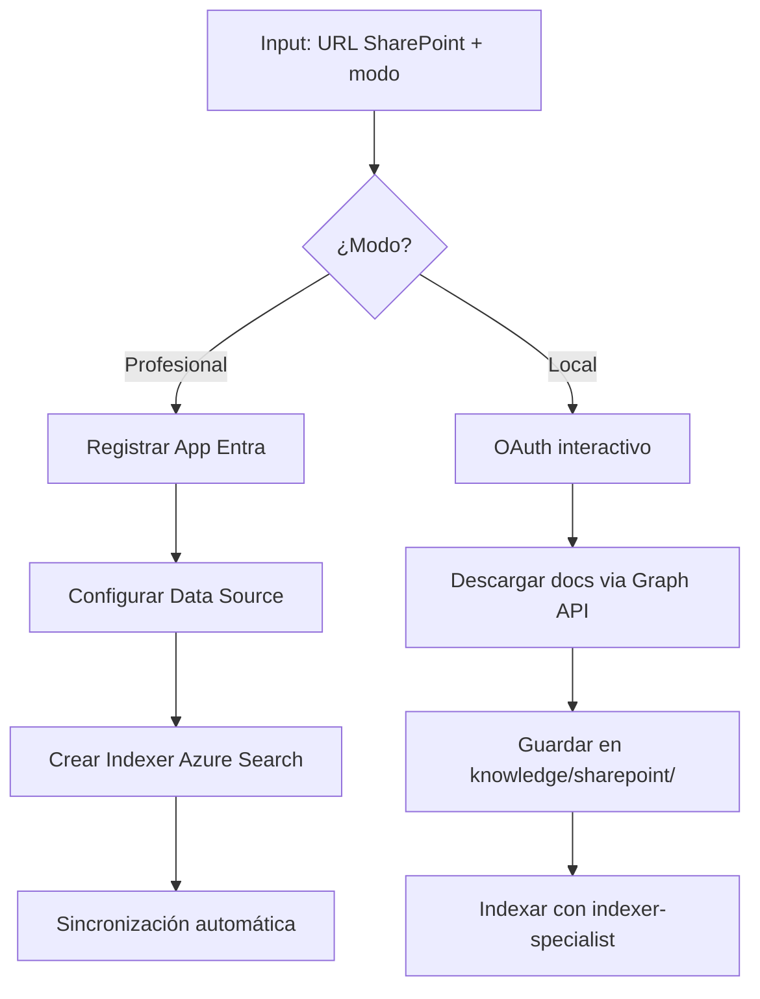

# PLAN: SharePoint Setup

**Spec:** `specs/sharepoint-setup/spec.md`  
**Estado:** Completado  
**Autor:** RAG Builder Team  
**Creado:** 2026-05-15

---

## 1. Enfoque Técnico

### Decisión de Arquitectura

Dos modos mutuamente excluyentes:
- **Profesional:** Azure Search indexer nativo → sincronización automática sin duplicación
- **Local:** Download de documentos a `knowledge/sharepoint/` → coexiste con docs locales, indexación manual



### Alternativas Consideradas

| Opción | Pros | Contras | Decisión |
|--------|------|---------|----------|
| Dual mode (pro + local) | Flexibilidad para cualquier org | Más código | ✅ Seleccionada |
| Solo modo profesional | Más limpio | No todas las orgs permiten indexer nativo | ❌ Rechazada |
| Solo descarga local | Más simple | Sin sincronización automática | ❌ Rechazada |
| Power Automate connector | No-code | Dependencia externa, menos control | ❌ Rechazada |

---

## 2. Dependencias

### Internas
- `rag-indexer-specialist` — para indexar docs descargados (modo local)
- `rag-azure-setup` — infraestructura (AI Search debe existir)
- `rag-agent-instrumentation` — telemetría

### Externas
- Microsoft Graph API (para listar y descargar docs)
- Azure AI Search Indexer (modo profesional)
- Entra ID App Registration (OAuth)
- Python: `msal`, `requests`, `azure-search-documents`

### Bloqueantes
- [x] Tenant ID y permisos de admin (para registrar app)
- [x] Sitio SharePoint accesible

---

## 3. Estructura de Ficheros

```
.github/agents/
└── rag-sharepoint-setup.agent.md      # Definición del agente

.github/skills/rag-sharepoint-connector/
├── SKILL.md                            # Definición del skill
├── sharepoint_connector.py             # Conector principal (dual mode)
├── oauth_helper.py                     # Flujo OAuth/MSAL
├── graph_client.py                     # Cliente Microsoft Graph
└── README.md
```

---

## 4. Flujo de Datos

**Modo Profesional:**
```
Config → Register App → Create Data Source → Create Indexer → Auto-sync
```

**Modo Local:**
```
Config → OAuth → List Files → Download → Save to knowledge/ → Trigger indexer
```

1. **Auth:** MSAL interactive o service principal
2. **Discovery:** Resolver site URL → site ID → drive ID
3. **Modo Pro:** Configurar Azure Search data source + indexer schedule
4. **Modo Local:** Download recursivo + mapeo de metadatos

---

## 5. Riesgos y Mitigaciones

| Riesgo | Probabilidad | Impacto | Mitigación |
|--------|-------------|---------|-----------|
| Permisos insuficientes en tenant | Alta | Bloqueante | Guía paso a paso de permisos requeridos |
| Token OAuth expira mid-sync | Media | Medio | Token refresh automático |
| Sitio con >10K documentos | Baja | Medio | Paginación + rate limiting |
| Formatos no soportados en SP | Baja | Bajo | Filtrar por extensión soportada |

---

## 6. Observabilidad

- **Métricas:** Docs sincronizados, frecuencia de sync, tamaño total
- **Logs:** Conexión OAuth, archivos procesados, errores de descarga
- **Alertas:** Sync falla 3 veces consecutivas, token expirado sin refresh

---

## 7. Esfuerzo Estimado

| Fase | Estimación | Notas |
|------|-----------|-------|
| Implementación | Completado | sharepoint_connector.py + oauth_helper |
| Testing | Completado | Validado con site de pruebas |
| Documentación | Completado | SKILL.md + README |
