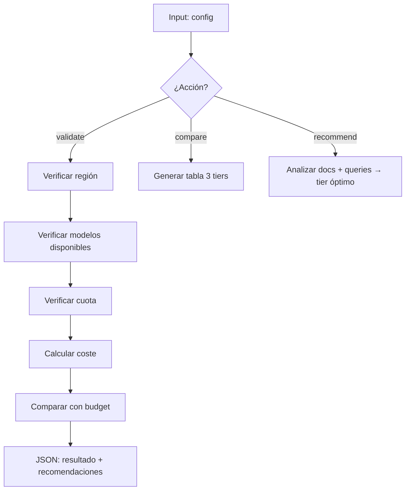

# PLAN: Validate Deployment

**Spec:** `specs/validate-deployment/spec.md`  
**Estado:** Completado  
**Autor:** RAG Builder Team  
**Creado:** 2026-05-15

---

## 1. Enfoque Técnico

### Decisión de Arquitectura

Validador Python read-only con 3 acciones: `validate` (verificar región + modelos + cuota + presupuesto), `compare` (tabla comparativa de tiers), `recommend` (sugerir configuración óptima). Nunca crea ni modifica recursos.



### Alternativas Consideradas

| Opción | Pros | Contras | Decisión |
|--------|------|---------|----------|
| Script Python read-only | Seguro, rápido, sin efectos secundarios | Requiere API calls para cuota | ✅ Seleccionada |
| Azure Policy check | Nativo Azure | No cubre costes ni recomendaciones | ❌ Rechazada |
| Dry-run de Bicep (what-if) | Valida despliegue real | No valida costes ni cuota en detalle | ❌ Rechazada |

---

## 2. Dependencias

### Internas
- `rag-cost-analyst` — tablas de precios por componente
- `rag-architecture-optimizer` — lógica de recomendación de tier

### Externas
- Azure CLI (para queries de cuota y disponibilidad)
- Azure Management APIs (modelos disponibles por región)
- Python: `azure-identity`, `azure-mgmt-cognitiveservices`, `azure-mgmt-search`

### Bloqueantes
- [x] Azure CLI autenticado
- [x] Permisos Reader en subscription

---

## 3. Estructura de Ficheros

```
.github/agents/
└── rag-validate-deployment.agent.md   # Definición del agente

.github/skills/rag-validator/
├── SKILL.md                            # Definición del skill
├── guidelines_validator.py             # Validador principal
├── cost_calculator.py                  # Cálculo de costes por tier
├── region_checker.py                   # Disponibilidad de modelos/regiones
└── README.md
```

---

## 4. Flujo de Datos

```
Config → Validación región → Disponibilidad modelos → Cuota → Cálculo coste → Recomendaciones → JSON
```

1. **Región:** Verificar que la región existe y soporta AI Search + OpenAI
2. **Modelos:** Verificar disponibilidad de cada modelo solicitado
3. **Cuota:** Consultar cuota restante en subscription
4. **Coste:** Calcular desglose mensual por componente
5. **Budget:** Comparar total con presupuesto declarado
6. **Recomendaciones:** Generar acciones PROCEED/WARN/BLOCK

---

## 5. Riesgos y Mitigaciones

| Riesgo | Probabilidad | Impacto | Mitigación |
|--------|-------------|---------|-----------|
| Precios de Azure cambian | Alta | Bajo | Actualizar tabla de precios periódicamente |
| API de cuota no disponible | Baja | Bajo | Skipear check de cuota con warning |
| Falso positivo en BLOCK | Baja | Medio | Siempre explicar el motivo + alternativa |

---

## 6. Observabilidad

- **Métricas:** Validaciones ejecutadas, tasa BLOCK vs PROCEED, acciones recomendadas
- **Logs:** Región validada, modelos checked, coste calculado
- **Alertas:** N/A (es herramienta puntual, no servicio continuo)

---

## 7. Esfuerzo Estimado

| Fase | Estimación | Notas |
|------|-----------|-------|
| Implementación | Completado | guidelines_validator.py + cost_calculator |
| Testing | Completado | Validado con múltiples regiones y tiers |
| Documentación | Completado | SKILL.md + README |
